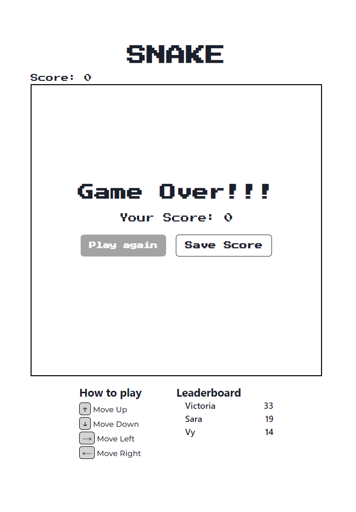

### Front end
Creat a .env file and add this 
```
REACT_APP_GRAPHQL_API_URL=http://localhost:9000/graphql
```

### Back end
Create a .env in the root and add those line
```
DB_USERNAME=<Your MongoDB username >
DB_PASSWORD=<Your MongoDB password >
DB_NAME=<Your Database name>
PORT=<PORT e.g 9000>
```


